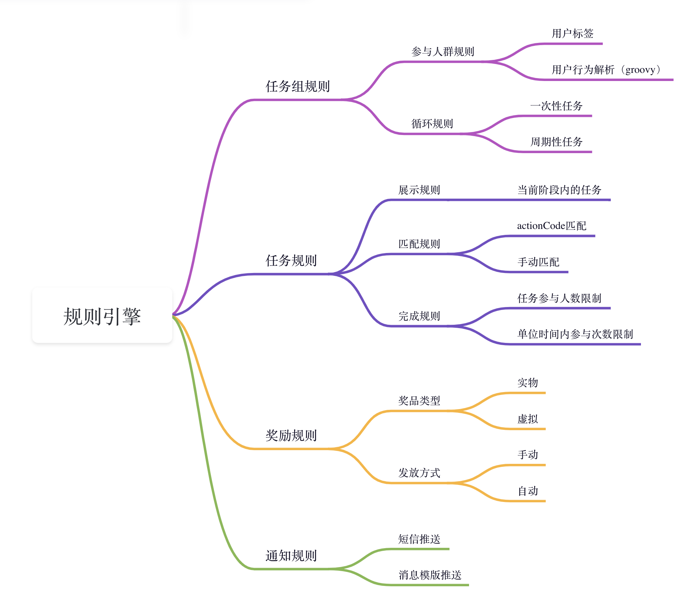

# UAS - 通用的运营活动系统

UAS = **U**niversal **A**ctivity **S**ystem

UAS 是一个基于 Spring Boot 开发的通用活动抽象与构建系统，用于快速批量创建各种定制化的运营活动

在日常的运营活动中，常见的活动有 转发、分享、点赞、抽奖、砍价等  
所以，可以抽象出：**某用户** **在某个时间段** **完成了某个任务** **获得了某种奖励**

目标：数据JSON化，运营流程化、接口SDK化

## 关键概念

- Activity: 面向用户发起的运营活动
- Task: 活动中用户可以参与的最小组织单元
- UserAction: 用户行为
- UserTask: 用户参与活动任务的记录
- Reward: 完成活动后的奖励
- Notice: 完成任务或活动后的通知

**实体关系图**

**流转关系**

**活动流程图**

**规则引擎**

[Quick Start](./docs/guide/README.md)

